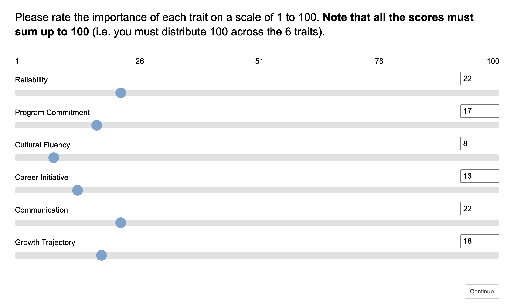
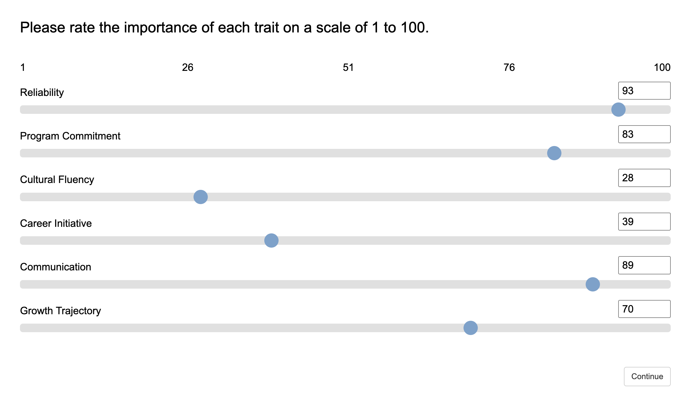
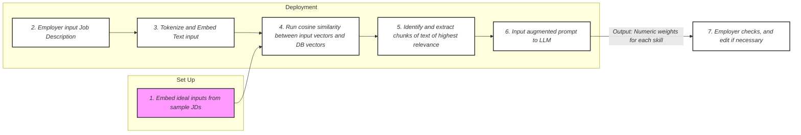
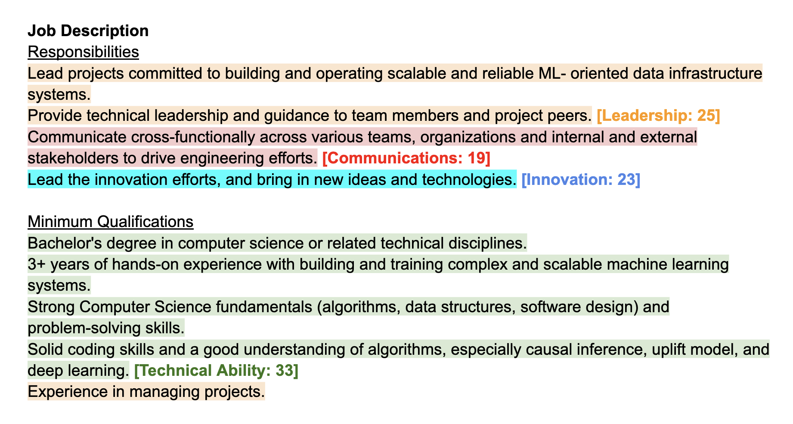

# Post-Pipeline Layer: Skill Matching for Employers

## Summary & Core Objective

The goal of this post-pipeline layer is to solve a key product problem: employers looking for student talent do not hire based on a single metric, but look for multi-skill profiles where they must constantly evaluate trade-offs (like communication vs reliability). Employers also look for different types of skills, for example some value communication more while others prefer technical ability.

We propose an automated process to match candidates to the employers. This will be done by taking in the unstructured Job Description (JD) as input, and determining weights (representing how much each employer values a metric). Finally, we will take a weighted average to generate an employer-specific score, which reflects how much the candidate matches the employer.

---

## Form Structure

To reduce the amount of time needed for busy hiring managers, we use a hybrid system. Employers can **paste their JD as an unstructured text block**, which our system automatically processes and shows them a preview of the weights. If employers are satisfied, they can proceed with the rest of the form. Otherwise, they **can manually adjust the weights** as well.

### Option 1: 100-point budget constraint

To prevent weight oversaturation, the form will have a **fixed 100-point budget constraint** for employers to distribute across the different skill metrics (this will be done using an interactive slider UI in the form). Without this constraint, hiring managers naturally assign maximum importance to every vector (e.g., "Communications: 100, Reliability: 100"), which forces a uniform weight profile, eliminating statistical variance, which defeats the purpose of a personalized weight system. Restricting the total allocation to a strict 100-point pool (e.g., "Communications: 22, Reliability: 78") forces employers to accept trade-offs.

  

A possible downside is that it might be unintuitive, as the 100 points will be spread thin across metrics, and "Communications: 22" might seem like a low importance when it is indeed high. If this is a problem, we can consider another alternative (with its own trade-offs).

### Option 2: Normalization

We can allow the employers to assign the weights for each trait independently (from 1 to 100), and normalize it using a simple program. The final weight will look like (Weight of metric i / Sum of weights of all metrics) * 100. The final output will be the same as that in Option 1, but the user-friendliness differs (each has its benefits and shortcomings).

  

The trade-off here would be the risk of oversaturation of the weights. If the employers are allowed to assign weights without constraints, many may put the maximum weight (of 100) for every trait, defeating the purpose of a weight system. 

Thus, if we were to go with this option, we must be very clear with the employers to allocate the weights appropriately.

---

## Weight Extraction and Allocation

This process for the automated weight allocation is done using Retrieval-Augmented Generation (RAG), and is summarized in the flowchart below. The elaboration of each step can be found in the next section.

**Possible shortcoming:** While the LLM might be able to infer the importance of each individual metric, it might not be able to understand the relative importance across multiple metrics, and hence might struggle to distribute the 100 points.

**Mitigation:** If the weights dont add up to 100 points, we can simply normalize them to ensure they sum to 100. And to improve the accuracy of relative weight allocation, the ideal JD (during set up) must be stricter to impose a greater variance.

## Elaboration of RAG Process

The numerical labels below follow the labels on the flowchart above.

Phase I: System Set Up

1. Embed ideal inputs from sample JDs: The system takes in a curated dataset of baseline job descriptions and processes them into standardized reference vectors to benchmark the grading criteria. (Can consider text-embedding-3-small or similar smaller models for embedding?)

Phase II: Deployment

2. Employer input Job Description: The hiring manager pastes their unstructured JD directly into the platform's interface.

3. Tokenize and Embed Text input: The backend API processes the incoming raw text, breaking it down into tokens and transforming it into a dense vector mapping the employer's intended meaning. This uses the same embedding model as that used in step 1.

4. Run cosine similarity between input vectors and DB vectors: The system calculates the similarity (mathematical distance) between the employer's input vector and our pre-established reference vectors (DB vectors) to find the closest alignment.

5. Identify and extract chunks of text of highest relevance: Using the similarity score, the system decides which chunks of text are most relevant to the weight allocation, and isolates them to prepare to pass into the LLM.

6. Input augmented prompt to LLM: The consolidated prompt is passed to the LLM, which runs its attention layers and assigns accurate metrics.

7. Employer checks, and edit if necessary: The system passes the resulting numeric weights to the client-side UI, automatically shifting the interactive sliders for verification and approval by the employer.

Here we have attached a picture of a JD to illustrate how the idea looks like. Using the RAG process from earlier, the system will analyse the different parts of the JD and rank the importance of each metric.

  

In the above JD, the four metrics (the metrics are only for illustration) we looked at were Leadership, Communication, Innovation, and Technical Ability (highlighted in different colours). As seen, the LLM should distribute 100 points across all the metrics to reflect their relative importance.

## Alternative to RAG

We note that different models will suit different situations, depending on the constraints faced. Thus, we looked at a few different alternatives, as listed.

| Method | Strength | Weakness |
| :---: | :---: | :---: |
| Direct LLM | Simple, flexible | Less consistent |
| RAG | Better grounding | More complex |
| Fine-tuning | Consistent, scalable | Needs labeled data |
| Rule-based NLP | Interpretable | Weak semantics |
| NER pipeline | Structured | Requires classification design |
| Embedding similarity | Fast, lightweight | Limited reasoning |

Given the limited information we currently have, we still feel that RAG is still the best option.

## Data Collection for Other Fields (if Applicable)

If we need employers to fill in other fields as well, we can extend the form to automatically fill in those fields as well, by taking information from the same JD used for the skill matching above. These fields could possible include:
- Workplace environment setting (like remote/in-person)
- Graduation date
- Minimum duration of commitment
- Visa requirements
- Technical skills required (like programming languages)

As these fields are simpler, we might not need to use LLMs. We can consider creating a local dictionary of the common JD terms, and do keyword matching using Regex. We can also choose to use LLMs if the volume of tokens needed is not too high. We can consider finetuning a NER model for the extraction of this data. Similar to the metric matching, employers can override if unsatisfied with the autofill.

---

## Weighted Average and Pruning

The previous steps of the pipeline provides us with the candidate' normalized competency scores (S). Our weight extraction form provides us with the employer's confirmed priority weight vector (W). To rank multi-skill trade-offs on a standardized scale, the system calculates a localized **Weighted Average formula** for every single eligible candidate profile:

Employer Match Score = Sum of all (W * S) / Sum of all W

* W represents the employer's importance weight for skill metrics (ranging from 1 to 5).
* S represents the candidate's normalized score for skill metrics coming directly from the upstream pipeline.

If the form includes certain mandatory criteria, we can also add in pruning to remove candidates that do not fit certain criteria (e.g. unable to commit for minimum duration), which can help save computation time as the system will not have to compute a score for the pruned candidates.

## Further Considerations and Areas to Expand On

If there is time or capacity, we can look into the following items to improve our system.

- The metrics used in the weighted average system must follow the 5-6 (may be up to 10 later) metrics defined in the previous 2 parts of the pipeline. If employers need metrics beyond what we have, either ignore them or do correlation with existing metrics

- Currently, the employer weights are generated primarily from the JD itself. However, employers may behave differently from what their JDs suggest. In the future, the system could continuously learn from the data of shortlisted candidates, interview selections, and hiring outcomes. This would allow the system to gradually personalize recommendations and better capture real employer preferences over time.

- Can consider explainable AI, highlighting the portions of the JD that led the LLM to the conclusion of the weights. This can improve the credibility of our system, so employers trust us more.

- Currently, the proposal uses a generalized weighted average formula. Future versions could explore nonlinear scoring models, ranking algorithms, or even reinforcement learning. These may better model real hiring decisions where employers value combinations of traits rather than isolated metrics. But this can only be considered after we get hold of more data.